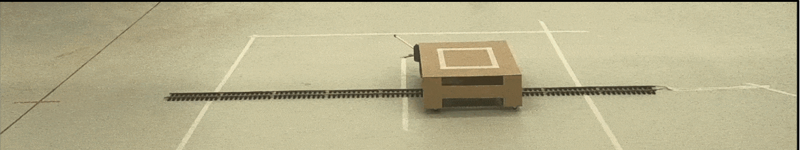

# Moving Platform Control
 

## General
This repository contains the code and some instructions about how a moving platform can be built and controlled using ROS. To this end, a ROS interface via [LibrePilot](https://github.com/robot-perception-group/LibrePilot/tree/be0a2d692110ab10cb0be75e5a6598a152cf01e0) is applied that leverages a [LibrePilot Revolution Flight Controller](https://librepilot.atlassian.net/wiki/spaces/LPDOC/pages/26968084/OpenPilot+Revolution) board for the generation of PWM values that can be used by an ESC to control a model train. Attached to the model train is a wooden structure with wheels - the moving platform.

